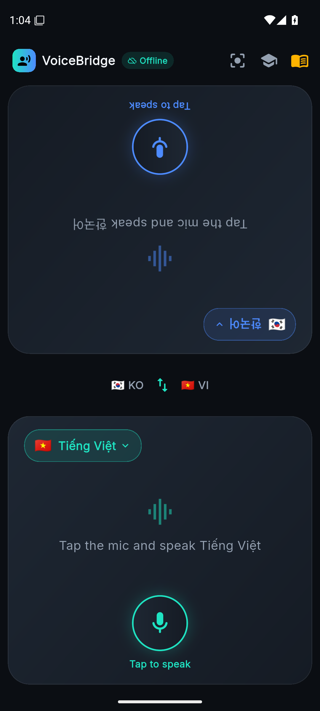
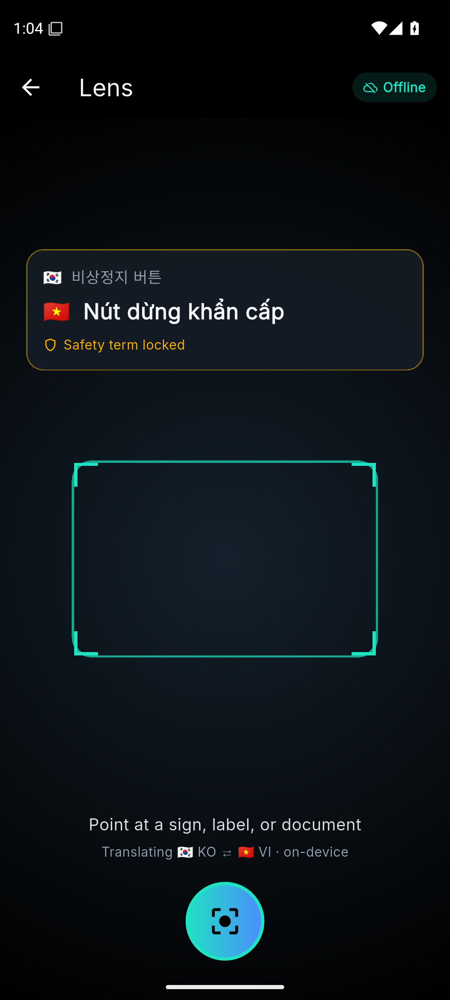
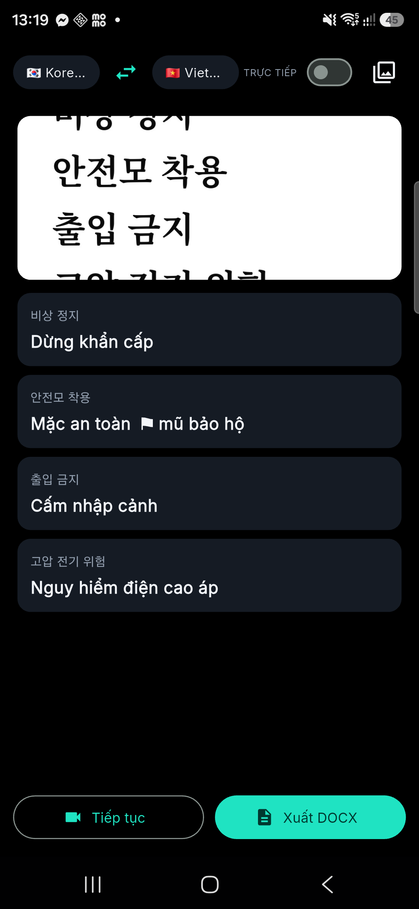
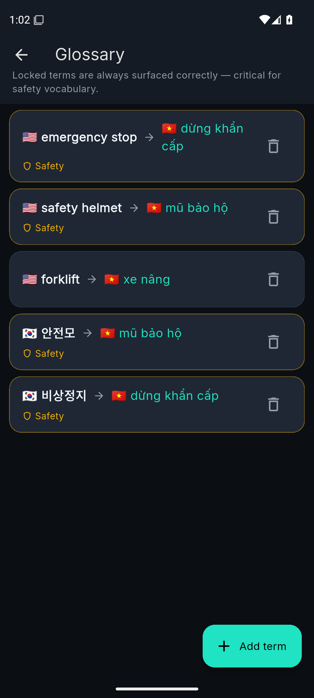

# VoiceBridge

Offline, on-device speech + sign translator for VN-centric industrial settings
(VN ↔ EN/KO/ZH). No cloud, no network.

## Screenshots
Captured on a real Samsung Galaxy S25 Ultra.

| Interpreter | Lens (live OCR) | Lens result (KO→VI) | Glossary |
|---|---|---|---|
|  |  |  |  |

The KO→VI shot is a real capture: a Korean safety sign OCR'd and translated
on-device, with locked glossary terms enforced (e.g. `안전모 착용` → "mũ bảo hộ").

## Features
- **Interpreter** — dual-facing live STT → MT → TTS; continuous hands-free mode
  alternates speakers (A→B→A); noise-robust hysteresis VAD.
- **Lens** — live camera OCR + translation overlay (toggleable), capture →
  **structured DOCX** with row/column reconstruction. Latin/KO/ZH scripts.
- **Glossary** — domain packs (Factory/Medical/Construction/General) + user
  terms persist across launches; locked terms surfaced verbatim.
- **Pronunciation dictionary** — respell names/jargon for TTS.
- **TTS frontend** (per-language EN/VI/KO/ZH) — numbers 0–999,999, currency,
  units, %, abbrev, acronyms, emails, URLs, versions, ordinals, fractions,
  ranges, decimals, times. Rules from NeMo/PaddleSpeech/Coqui/g2pK.
- **History** — every turn stored (JSONL), session-split (>5 min), share/clear.
- **Tiered models** Accuracy/Balanced/Light; custom: TTS rate, VAD sensitivity,
  defaults (continuous, live OCR, glossary). UI in 🇻🇳/🇺🇸 with picker.
- Unit-tested (`test/`: settings routing, TTS normalization, glossary, history, downloader,
  data-driven pipeline cases); fully offline.

## Pipeline (measured; per-language routing; Apache/MIT/BSD except where noted)
Each stage routes by language — no single model is best for all of VN/EN/KO/ZH.

| Stage | Model(s) | Measured |
|---|---|---|
| ASR | PhoWhisper (VN) + Whisper (KO/ZH/EN) | FLEURS WER: VN **11.0**¹ · KO **13.8**–23.3 · ZH **7.3**–21.9 (CER) · EN 16.6² |
| MT | MADLAD-3B (Apache) / Gemma 3n E2B | FLORES-1012 spBLEU **32.01** / **32.81**³ |
| OCR | PP-OCRv5 (ZH/KO) + VietOCR (VN) + ML Kit | ReCTS real signage **48.5%** full recall, 66% char · ~2.2 ms NPU |
| TTS | Supertonic-3 (VN/EN/KO) + MeloTTS (ZH) | RTF **~0.20** CPU (≈5× real-time) |

1 PhoWhisper-small; PhoWhisper-medium measures 9.8%.
2 Whisper-tiny only — not separately measured on small/turbo.
3 Gemma 3n E2B (use-restricted license). Gemma 4 E2B is Apache-2.0 but hasn't been
separately re-measured on this benchmark — don't assume the number transfers; MADLAD-3B
(Apache-2.0, license-clean) is the safer default until it is.

**On-device ASR is live:** KO/ZH/EN run multilingual Whisper-small through sherpa-onnx
(Apache-2.0, ONNX Runtime), verified end-to-end on an S25 Ultra (~0.38× RTF, faster than
real time); VN uses PhoWhisper. The accuracy tier upgrades KO/ZH to Whisper-large-v3-turbo.
MT still ships ML Kit on-device, with MADLAD/Gemma as the planned NPU upgrade. On stock
phones the *signed* FastRPC PD is blocked, but the *unsigned* PD (and the Adreno GPU, which
needs no signing) is open — so the accel path is GPU-first (LiteRT OpenCL), HTP-NPU as a stretch.

## Docs
- [`docs/`](docs/README.md) — architecture, models, on-device STT.

## Build
`flutter pub get && flutter build apk --release` (Flutter 3.44, minSdk 24).

Author: Viet-Anh Nguyen, Neural Research Lab.
